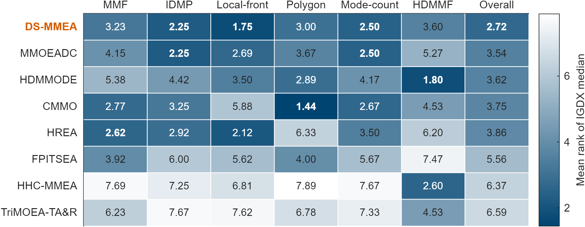
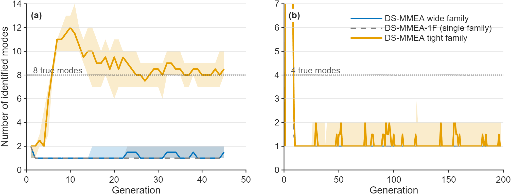
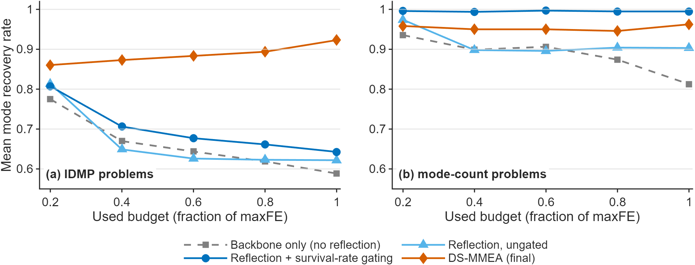

# DS-MMEA — Dual-Scale Co-evolutionary Algorithm for Multimodal Multiobjective Optimization

Official repository for the paper

> Wenhua Li, Rui Wang, Tao Zhang, Xin Lu,
> **"Dual-Scale Co-evolutionary Algorithm for Multimodal Multiobjective Optimization"**,
> submitted to *IEEE Transactions on Evolutionary Computation*.
> *(paper DOI / preprint link: XXX)*

## Naming

The algorithm's paper name is **DS-MMEA** (Dual-Scale Multimodal Multiobjective
Evolutionary Algorithm). Inside the code the algorithm class is `MSCoSEA` (the
development codename, kept so the frozen data pipeline and analysis scripts stay
valid); `DSMMEA.m` is a paper-named subclass that runs the identical
configuration, so fresh experiments can call either entry point.

DS-MMEA is a multimodal multiobjective evolutionary algorithm (MMOEA). Instead of
searching for a single Pareto-optimal solution, multimodal problems require finding
**every equivalent Pareto-optimal set**. DS-MMEA keeps one selection principle
(survival is judged *relative to the modes found so far*, never globally) and runs
two parallel subpopulations with different clustering scales: a **wide** family that
keeps continuous curves and fused colonies intact, and a **tight** family that
separates sparse colonies from weak modes. The two families share an offspring pool
and merge for mating; the delivered population is filtered by a mode-relative report
layer and truncated by a maximin criterion.

## Main result

Across the 71-instance, 6-group benchmark suite, DS-MMEA obtains the best overall
Friedman average rank of the 8 compared algorithms (IGDX, median of 10 paired runs
per instance; 2.72 versus 3.54 for the runner-up). Per-group ranks, head-to-head
statistics, ablations, runtime, and the failure cases we report on ourselves are in
the paper and in `Supplementary.pdf`.



**How the two scales divide the work.** Left: mode counts tracked over the run on two
sentinel problems — the single-scale predecessor (v3.1) collapses wide and tight
behavior into one loop, DS-MMEA gets both. Right: the tight family separates the
sparse colony (green) that the wide family fuses into the main curve.



**Discovery and maintenance.** Mean niche-recovery rate over the evaluation budget on
the IDMP groups: the backbone without the reflection channel stalls, while the
reflection channel recovers nearly all modes early.



## Repository layout

```
DS-MMEA/
├── README.md, LICENSE, NOTICE        this file; MIT license; third-party credits
├── Supplementary.pdf                 the paper's supplementary material (28 pages)
├── platemo.m                         entry point (slim PlatEMO, command-line use)
├── PlatEMO/
│   ├── Algorithms/                   MSCoSEA + lineage + the 7 compared baselines
│   ├── Problems/                     MMF, IDMP, IDMP_e, HDMMF (NMMF), Polygon
│   ├── Metrics/                      PlatEMO metric utilities
│   └── ReferenceData/TruePSPFdata/   ground-truth PS/PF caches for truth queries
├── Problems_ext/                     parameterized problem classes (Polygon_p, IDMP*_p)
├── Metrics_MMO/                      IGDX/IGDF and mode-truth metric functions
├── analysis/                         scripts that generate every table and figure
├── results/
│   ├── Data/<config>/<problem>__r<k>.mat   per-run archives (see "Data" below)
│   ├── behavior/behavior.json              aggregated per-generation behavior stats
│   └── runtime_solo.mat, runtime_solo.log  single-run wall-clock audit
└── figures/                          images used in this README
```

**Algorithms under `PlatEMO/Algorithms/Multi-objective optimization/`**

| Folder | What it is |
|---|---|
| `MSCoSEA` (+ `DSMMEA`) | the proposed algorithm (paper name **DS-MMEA**; `DSMMEA.m` is the paper-named entry point, a one-line subclass; ablation switches inside `MSCoSEAConfig.m`) |
| `MRCoSEA` | single-family predecessor (v3.1); the `MRCoSEA31` ablation arm and part of DS-MMEA's runtime |
| `CoSEA` | earlier backbone (v0.8) used by DS-MMEA and the development-lineage figures |
| `HREA`, `MMOEAC`, `CMMO`, `TriMOEA-TA&R`, `HHC-MMEA`, `HDMMODE`, `FPITSEA` | the 7 external baselines (paper names: HREA, MMOEA-DC, CMMO, TriMOEA-TA&R, HHC-MMEA, HDMMODE, FPITSEA) |

## Requirements

* MATLAB R2021b or newer (developed and tested on R2023b). No GUI is needed; the
  copy of PlatEMO shipped here is used from the command line only.
* Statistics and Machine Learning Toolbox (for the Wilcoxon signed-rank tests in
  the table scripts). The algorithms themselves are plain MATLAB.

## Quick start

Run DS-MMEA on the 2-objective problem MMF1 with the paper protocol for that
instance (population 200, budget 10,000 evaluations):

```matlab
addpath(genpath('PlatEMO'));
addpath(genpath('Metrics_MMO'));
addpath(genpath('Problems_ext'));

platemo('algorithm', {@DSMMEA}, 'problem', @MMF1, 'N', 200, 'maxFE', 10000);
```

The final population is returned and plotted. All ablation variants of the paper
are switch settings of `MSCoSEAConfig.m` (default = the paper configuration).
To score a delivered population the way the paper does, use the functions in
`Metrics_MMO/` (decision-space IGD against the mode-partitioned true PS, and the
mode-recovery statistics used in the figures).

## Reproducing the paper's tables and figures

Every table/figure script lives in `analysis/` and reads only the frozen data in
`results/`. From the repository root (paths inside the scripts are already set for
this layout):

```matlab
addpath(genpath('PlatEMO')); addpath(genpath('Metrics_MMO')); addpath('analysis');
cd analysis
export_tab2_main          % Table 2: main comparison, 71 instances x 8 algorithms
fig06_rankmap             % README figure above (rank heatmap)
```

Outputs are written to `analysis/out/`.

| Script | Output | Data used |
|---|---|---|
| `export_tab1_problems.m` | Tab. 1 + per-instance list | benchmark definition; truth cache computed on the fly if absent |
| `export_tab2_main.m` | Tab. 2 (main comparison) | `results/Data` (IGDX) |
| `export_tab3_ablation.m` | Tab. 3 (paired ablation) | `results/Data` |
| `export_tab4_runtime.m` | Tab. 4 (runtime audit) | `results/runtime_solo.*`, `results/Data` |
| `fig01_discovery_recovery.m` | niche-recovery curves | per-run generation checkpoints (shipped) |
| `fig02_scale_dilemma.m` | the scale-dilemma illustration | none (deterministic toy data) |
| `fig04_dualfamily_modes.m` | dual-family mode dynamics | mechanism logs of two sentinel problems (shipped) |
| `fig05_g5_modeloss.m` | mode-loss case study | final populations of a sentinel problem (shipped) |
| `fig06_family_division.m` | family division of labor | `results/behavior/behavior.json` (shipped) |
| `fig06_rankmap.m` | mean-rank heatmap | `results/Data` (IGDX) |
| `fig07_coverage_evolution.m` | delivered coverage across the budget | `results/behavior/behavior.json` (shipped) |
| `fig07_popshow.m` | population showcases vs. MMOEA-DC | final populations of 4 showcase problems (shipped) |

## Data: what is in `results/Data`, and what comes later

`results/Data/<config>/<problem>__r<k>.mat` holds one file per (algorithm
configuration, benchmark instance, run) for 13 configurations (MSCoSEA, its two
ablation arms `MSCoSEA_nomani` / `MRCoSEA31`, the development lineage
`CoSEA` / `CoSEA_off` / `CoSEA_v07`, and the 7 external baselines; folder names as
in the table above). Every file keeps the per-run scalars the paper's statistics
are computed from: `IGD`, `IGDX`, `IGDXnorm`, `PSP`, `rPSPval`, `rPSPstd`,
`recRate`, `fullRec`, `nModes`, `resolvable`, `runtime`, `FE`, `maxFE`, `seed`,
plus the problem/config identity. Three fidelity tiers are used:

* **lite** (most files): scalars only — everything the tables and the aggregate
  figures need;
* **checkpoint** tier: adds `ckpt`, the population at five 20%-budget checkpoints
  (used by `fig01_discovery_recovery.m`);
* **full** tier: verbatim copies including the final `PopDec`/`PopObj` and the
  per-generation mechanism log `injlog` (used by the showcase figures).

The complete per-run archives (all fields for every run, ~1.3 GB) will be attached
to this repository upon paper acceptance *(link: XXX)*.

The seed table is identical for every algorithm: seed = 20260907 + 1000·run +
problem index, 10 independent runs per instance (20 for the Polygon robustness
check on DS-MMEA and its ablation arms).

Note: `CoSEATruePS` (the mode-truth provider in `Metrics_MMO/`) writes a speed-up
cache of the ground-truth sets to `exp/rq3/TruthCache/` inside the repository on
first use. This folder is derived data, git-ignored, and safe to delete at any
time.

## License and attribution

The code is released under the [MIT License](LICENSE). Third-party components —
the PlatEMO platform, the 7 baseline algorithm implementations, and the benchmark
suites with their reference data — are credited individually in [NOTICE](NOTICE).

## Contact

Corresponding author: Rui Wang (College of Systems Engineering, National
University of Defense Technology). Questions and bug reports are welcome via
Issues.
